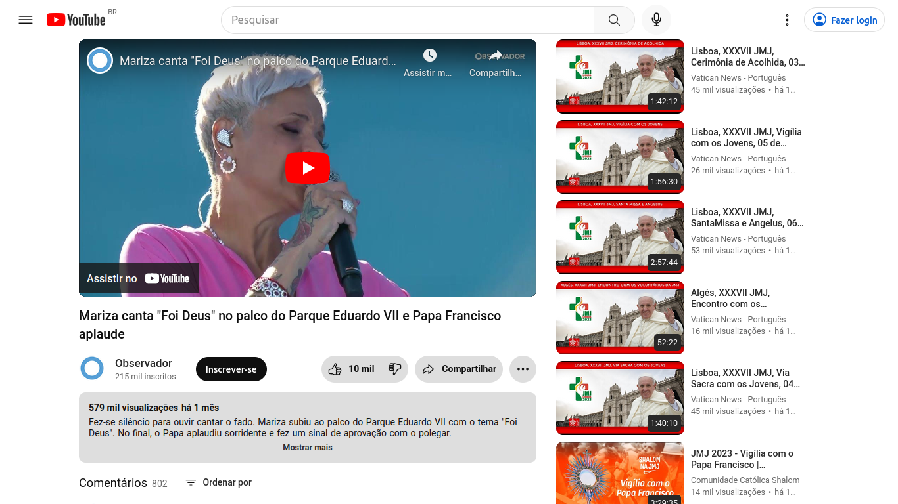
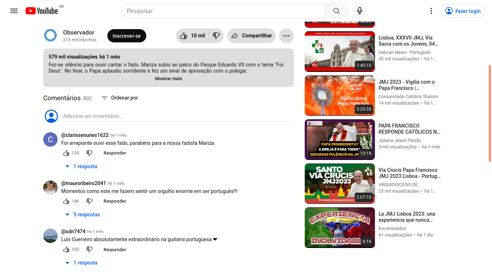
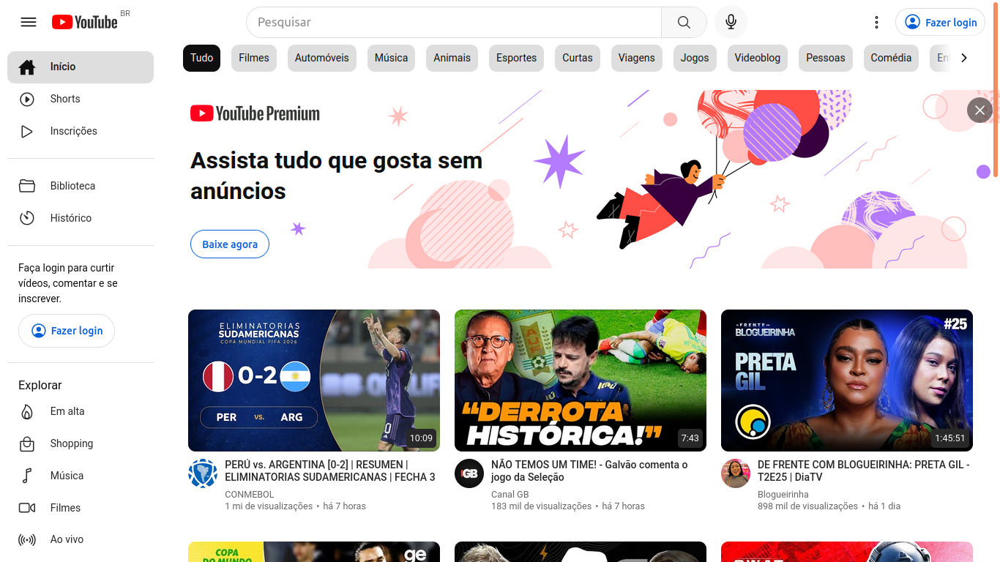
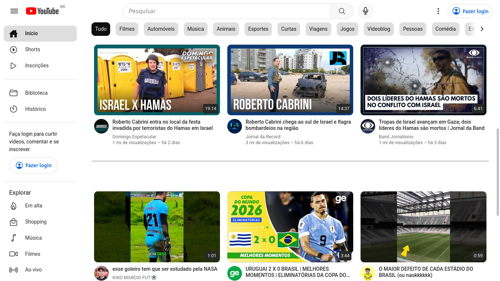
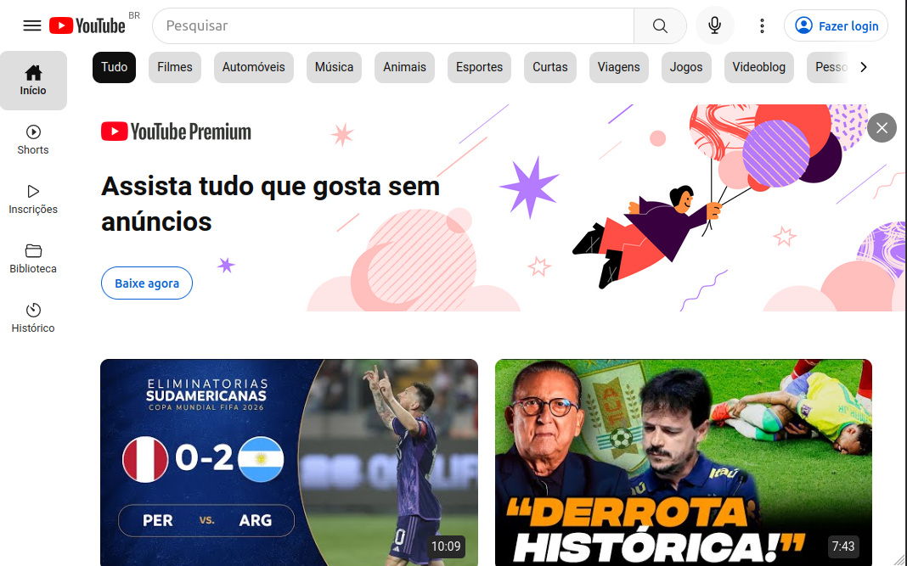
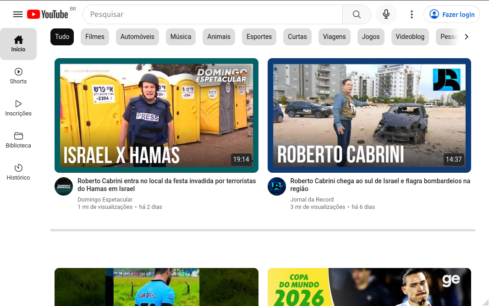
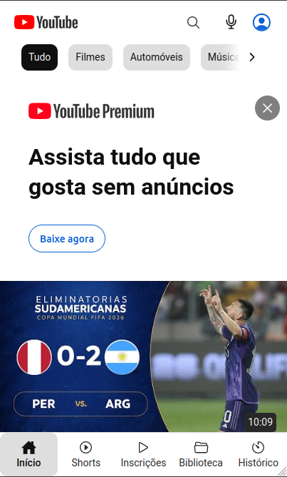

# Recriando a interface do Youtube :arrow_forward:

Este projeto apresenta uma recriação da interface do Youtube. São apresentadas as páginas inicial e de reprodução de vídeo.

Além de usar a tríade HTML, CSS e JavaScript foram utilizadas tecnologias como a extensão Sass na estilização, a biblioteca React junto com o recurso Hooks e a biblioteca Redux para o gerenciamento de estados. Buscou-se desenvolver um layout com adaptação responsiva.

Para carregar os dados na aplicação e permitir a reprodução do vídeo foram utilizadas a API YouTube Data e um componente player que faz uso da YouTube API do IFrame utilizando React.

## :gear: Tecnologias

- HTML
- CSS
- JavaScript
- React
- Redux
- Sass

## :art: Layout

